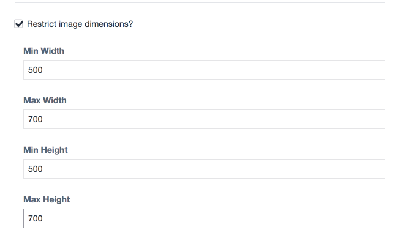
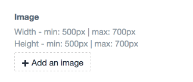
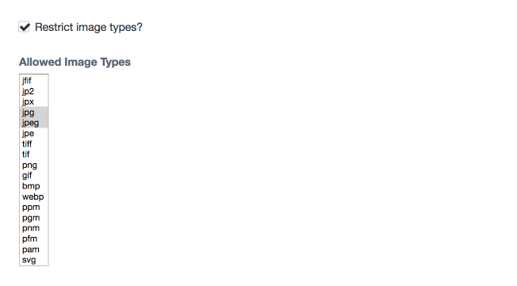

# Advanced Image Field

**Note**: This plugin may become a paid add-on when the Craft Plugin store becomes available.

## Requirements

This plugin requires Craft CMS 3.0.0-RC1 or later.

## Installation

To install Advanced Image Field, follow these steps:

1. Install with Composer via `composer require alexmarchant/advanced-image-field` from your project directory
2. Install plugin in the Craft Control Panel under Settings > Plugins

Advanced Image Field works on Craft 3.x.

## Advanced Image Field Overview

This plugin extends the Asset field type, and support most of the options from that field type, in addition it adds two features:

1. Restrict image dimensions
2. Restrict image type (by file extensions)

---

**Restrict image dimensions**

---

**Required dimensions are shown on the front end**

---

**Restrict image type**

